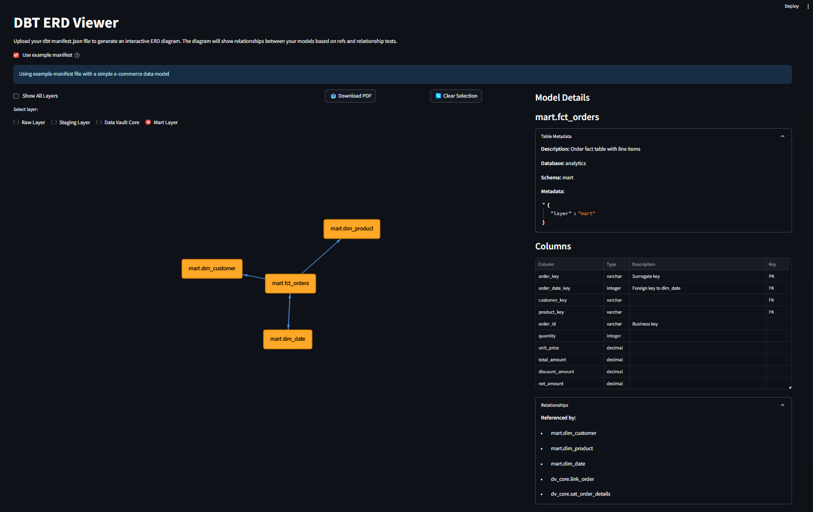

# DBT ERD Viewer

An interactive visualization tool that transforms your dbt project's data model into a beautiful, explorable Entity Relationship Diagram (ERD). Perfect for documentation, onboarding, and understanding complex data relationships in your dbt project.



## Why Use This?

### 📊 Better Data Model Understanding
- **Visual Representation**: See your entire data model in one interactive diagram
- **Layer-based Views**: Filter by layers (raw, staging, core, mart) to focus on specific parts of your model
- **Relationship Exploration**: Click on any model to see its connections and explore related tables

### 🎯 Perfect for dbt Projects
- **Native dbt Integration**: Works directly with your dbt project's manifest.json
- **Relationship Tests**: Visualizes relationships defined in your dbt tests
- **Model Metadata**: Shows descriptions, columns, and technical metadata for each model

### 💡 Use Cases
1. **Documentation**: Create visual documentation of your data warehouse structure
2. **Onboarding**: Help new team members understand the data model quickly
3. **Development**: Plan and validate model relationships while developing
4. **Presentations**: Showcase your data architecture to stakeholders

## Features

- 🔄 Interactive ERD visualization
- 🎨 Layer-based filtering (raw, staging, core, mart)
- 🔍 Model details on click (columns, relationships, metadata)
- 🌐 Network-style exploration of model relationships
- 📱 Responsive design that works on any screen size
- 🎯 Focus mode to highlight selected models and their connections

## Quick Start

The easiest way to run the application is using Docker:

```bash
# Clone the repository
git clone https://github.com/EmilSundman/showcase-dbtERD
cd showcase-dbtERD

# Start the application
docker compose up -d --build

# Open in your browser
# Navigate to http://localhost:1000
```

## Using with Your dbt Project

1. **Generate Manifest**:
   ```bash
   cd your-dbt-project
   dbt compile
   ```
   This creates `target/manifest.json`

2. **Upload to ERD Viewer**:
   - Open the ERD Viewer in your browser
   - Upload your `manifest.json` file
   - Or use the example manifest to explore features

3. **Explore Your Data Model**:
   - Select layers to view different parts of your model
   - Click on models to see details and relationships
   - Use the "Show All Layers" option for a complete view

## Enhancing Your dbt Models

Make your ERD more informative by adding these to your dbt models:

```yaml
# models/staging/schema.yml
version: 2

models:
  - name: stg_customers
    description: "Staged customer data with basic transformations"
    meta:
      layer: staging  # Used for layer-based filtering
    columns:
      - name: customer_id
        description: "Unique customer identifier"
        meta:
          is_key: true  # Shown as PK in the ERD
    tests:
      - relationships:
          to: ref('raw_customers')
          field: customer_id  # Creates relationship arrow in ERD
```